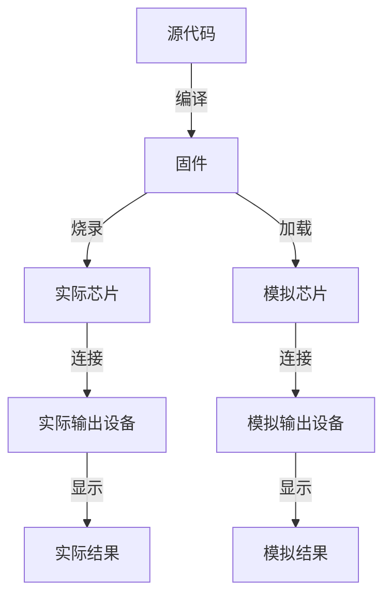

## 基本概念

MCU 全称为 **微控制器**。MCU 开发指编写能够在微控制器上运行的程序。

由于 MCU 指令集通常比较特殊，主流的编程语言中只有 C 对这些小众指令集支持最好，因此，MCU 开发通常使用 C 编写源代码。代码编译后生成 MCU 能够执行的指令序列，即固件。对固件的处理方式会根据有无实际硬件而发生变化

## 环境搭建

由于我没有实际硬件，且不喜欢非开源的东西，所以稍微研究了一下环境搭建的方式。

我目前使用的方案是 VSCode + PlatformIO IDE + SimulIDE

- VSCode 写代码
- PlatformIO IDE 编译代码，生成固件。由于不同架构的处理器通常需要使用不同的编译器，因此这里只写了 PlatformIO IDE，它会帮你处理这些事情。如果你很清楚自己使用的是哪种芯片，那么可以考虑自己处理编译过程，比如 STM32 可以使用 ARM GCC + CMake 编译出固件。另外，如果不想过度依赖图形化界面，可以 [安装 PlatformIO Core](https://docs.platformio.org/en/latest/core/installation/index.html)，这是一个 CLI 工具。
- SimulIDE 绘制电路图，将模拟芯片和模拟输出设备连接，加载固件并运行，从而可视化地查看结果

### SDCC

SDCC 通常用于 8051 MCU 的开发。

由于 [vscode-cpptools issues#2499](https://github.com/Microsoft/vscode-cpptools/issues/2499)，目前 VSCode 官方的 C/C++ 扩展并不完全支持 SDCC 扩展的语法。虽然可以手动修改 `.vscode/c_cpp_properties.json` 的 `defines` 字段让编辑器识别一些扩展类型，但这只是权宜之计。PlatformIO IDE 会自动更新配置文件，也明确表示了不要手动修改 `.vscode/c_cpp_properties.json` 文件。这个问题的真正解决只有等待 C/C++ 扩展正式支持 SDCC 了。
