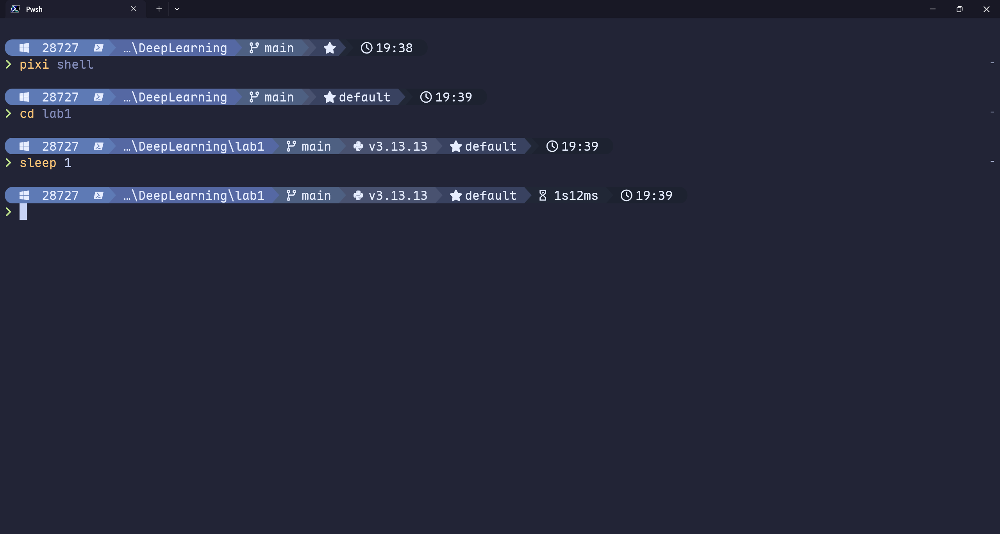

## 简介

Starship 是跨平台、跨 Shell 的 prompt 自定义工具。

## 对比

Prompt 美化工具有很多，但我最喜欢 Starship，主要有以下优点

- 由于使用 Rust 实现，所以速度很快
- 由于使用 Rust 实现，所以可以跨平台
- 可以跨 Shell 使用，只需要一份配置文件

## 安装

```sh
# Windows
scoop install starship
```

## 使用

### Shell 集成

Starship 支持非常多的 Shell，你可以在 [官方指南](https://starship.rs/guide) 中找到集成方法。

对于 Pwsh，添加如下命令到 `$PROFILE` 里

```pwsh
Invoke-Expression (&starship init powershell)
```

### 配置文件

使用 `starship config` 可以打开配置文件。

官网上有很多的 [预设](https://starship.rs/presets/)，还有详细的 [配置说明](https://starship.rs/config/)。建议先去看看有没有喜欢的预设，复制过来后再对着配置说明自行修改。

我用的配置文件已公开在 [Github](https://github.com/Juemuren/.dotfiles/tree/main/starship)。它是在 [Catppuccin Powerline Preset](https://starship.rs/presets/catppuccin-powerline) 这个预设的基础上修改的，效果如下



这个配置非常的花哨和臃肿，建议按需开启功能。`starship explain` 这个命令可以查看当前每个模块所消耗的时间，当感觉速度无法忍受时，可以把耗时比较久的模块禁用掉
