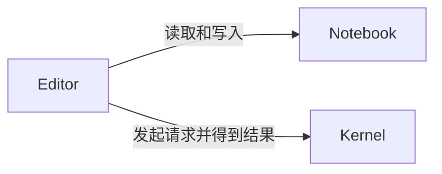

import { Steps } from '@astrojs/starlight/components';

## 简介

一个完整的 Jupyter 由 Notebook、Editor、Kernel 三部分组成。

- Notebook 即笔记本是一个 JSON 文件，保存了文档、代码和运行结果。
- Kernel 即内核负责执行代码，并保存着语言的运行时状态。
- Editor 即编辑器负责修改 JSON 文件并与内核通信。

因此，完整的 Jupyter 就是一个开发环境。

## 原理

Notebook 是一个持久化 JSON 文档，编辑器对其进行解析、渲染和修改。

Kernel 是一个更高级的、有状态的、可远程通信的 REPL。内核会持续运行，是独立进程，保存语言运行时状态，并通过 Jupyter 消息协议提供代码执行和交互能力。

Editor 是一个 Notebook 文档编辑器，同时也是 Kernel 的客户端。编辑器根据 Jupyter 消息协议，把 `*.ipynb` 里的代码块作为请求发给内核，再把内核返回的消息转换为代码块的输出，最后写入时序列化为 JSON。

因此，Kernel 是语言的临时状态，Notebook 是持久化的文档，而 Editor 在二者之间架起桥梁。



## 功能

### 编程笔记本

Jupyter 使用特殊的 `.ipynb` 文件格式，可以将文档、代码、运行结果等放在一起展示。具体的渲染效果和编辑器有关。

- 文档使用 Markdown 格式，运行结果中不仅包含文本输出，还可能有图片、可交互组件等内容。
- 代码支持不同的语言，编辑器可以直接渲染，但执行需要分别安装对应的内核。

:::note[Jupyter 的发展历史]

最早 Jupyter 叫做 `IPython Notebook`，只支持 `python`，这也就是为什么文件扩展名为 `.ipynb`。后来改进了架构，分离出了内核，可以支持更多的语言，比如 `Julia` 和 `R`，这便是新名字 `Ju(Julia)pyt(Python)er(R)` 的由来。

:::

Jupyter 的这种笔记本格式可以把代码、文本、图片、公式、图表作为一个复合文档统一展示。别人打开笔记本时可以看到你记录的完整分析过程、所有源代码和全部运行结果，也可以简单地重新运行部分代码看看是否能够复现。

这种笔记本格式也可以使用工具（比如 `nbconvert`/`jupytext`/`pandoc`）导出为别的格式，包括但不限于 HTML / PDF。

### 远程开发

Jupyter 由于编辑器和内核分离的架构设计，天然适合远程开发。这使得 Jupyter 在人工智能和科学计算领域非常流行。这些领域非常依赖机器性能，有了 Jupyter 后只需用轻薄本连上一个强大的远程服务器，就可以愉快地开发了。

### 学习和探索

Jupyter 代表了一种新的编程方式——探索式编程。这可以看作一种更高级的 REPL。代码写在一个个代码块里，可以单独运行一个代码块，也可以一次运行多个选定的代码块。而这些代码运行后，内核保存着运行时的状态，再运行新的代码块不需要重新启动进程，可以在之前的状态上继续。

比如对于机器学习任务，需要先导入大型库和巨量数据集，然后才能定义模型并设定一些参数进行训练，最后还要根据训练的效果返回去调整参数或模型。Jupyter 可以让调整的时候，不用重新导入库和数据集。这极大地提升了探索和调试的效率。

一些 Jupyter 内核还提供了魔法命令，包含很多实用功能，比如直接运行外部命令。这使得 Jupyter 不仅仅是一个编辑器，而成为了一个集成开发环境。

## 安装

Jupyter 为了远程开发和多语言支持而设计了复杂的架构。因此，想要本地使用 Jupyter，要同时有编辑器和内核。当然，如果只进行远程开发，那么本地有编辑器就行了，内核可以运行在别的机器上。

### 安装编辑器

如果使用 `VSCode`，那么需要下载 [Jupyter](https://marketplace.visualstudio.com/items?itemName=ms-toolsai.jupyter) 扩展。

如果使用 `JupyterLab`，那么可以通过 `pip install jupyterlab` 安装。

### 安装内核

内核根据语言选择。Python 的内核一般用 `ipykernel`，可以通过 `pip install ipykernel` 安装。

可以在 https://github.com/jupyter/jupyter/wiki/Jupyter-kernels 上找到目前能用的所有内核。

## 使用

### VSCode

使用 VSCode 作为编辑器可以参考 [官方文档](https://code.visualstudio.com/docs/datascience/jupyter-notebooks)，里面有很详细的使用方法说明。

### JupyterLab

使用 JupyterLab 需要启动或连接一个 JupyterLab 服务。本地使用时可以在项目根目录运行命令启动服务器。

```sh
jupyter lab
```

服务器启后会自动在浏览器中打开给定的 URL。

后续的使用方法可以参考 [官方文档](https://jupyterlab.readthedocs.io/en/stable/getting_started/overview.html)

### 导出

导出可以使用 `nbconvert`，通过 `pip install nbconvert` 安装。VSCode 的导出实际上就使用了 `nbconvert`

`nbconvert` 支持导出为多种格式，不过最常用的还是 HTML 和 LaTeX。而 PDF 可由二者进一步处理得到。

#### HTML

```sh
# 将 example.ipynb 导出为 export.html
jupyter nbconvert example.ipynb --to html --output export
```

一些常用的选项

- `--template` 指定模板。HTML 导出可使用 `lab` / `classic` 等内置模板，也可以自定义模板或下载社区里的模板。
- `--no-prompt` 不保留提示符
- `--clear-output` 清除代码块输出，同时也会修改原笔记本。如果只需要在导出的文档中隐藏代码块输出，可以使用 `--TemplateExporter.exclude_output=True`。

之后可以用浏览器的打印功能，将 `*.html` 文件转为 PDF。如果偏爱脚本也可以用 [无头浏览器](../网络/Chrome.md#无头模式) 来打印

:::caution[HTML 的排版缺陷]

`lab` 模板的 HTML 在打印为 PDF 后，会截断非常长的代码行。

并且由于 HTML 不是专为排版设计的标记语言，因此很多时候排版效果并不好。如果比较在意排版，建议使用 LaTeX。

:::

#### LaTeX

导出为 LaTeX 还需要安装 [Pandoc](https://pandoc.org/installing.html)。

```sh
# 将 example.ipynb 导出为 export.tex
jupyter nbconvert example.ipynb --to latex --output export
```

如果原 `ipynb` 文件中有图片等非文本输出，则上述命令会创建一个文件夹 `export_files` 来保存这些文件。

LaTeX 导出默认使用 `latex` 模板，可以自定义模板或下载社区里的模板。

:::tip[LaTeX 的中文配置和效果改善]

由于 LaTeX 不像 HTML 那样天然支持中文，并且内置的模板和 Jupyter 笔记本的实际渲染内容有所差异，因此建议下载社区的模板或自己修改模板。

我目前的做法是魔改 [nb_pdf_template](https://github.com/t-makaro/nb_pdf_template) 模板

<Steps>

1. 到 [share/templates/latex_authentic](https://github.com/t-makaro/nb_pdf_template/tree/master/share/templates/latex_authentic) 页面下载 [conf.json](https://github.com/t-makaro/nb_pdf_template/blob/master/share/templates/latex_authentic/conf.json) 和 [index.tex.j2](https://github.com/t-makaro/nb_pdf_template/blob/master/share/templates/latex_authentic/index.tex.j2) 这两个文件。
2. 把文件手动复制到对应环境的模板文件夹中。若 Python 环境是用 `miniforge` 安装的，则其具体位置为 `/path/to/miniforge/envs/<env_name>/share/jupyter/nbconvert/templates/<template_name>`，其中 `<template_name>` 为模板名，可以自己命名。
3. 修改 `index.tex.j2` 文件，将 `\documentclass[11pt]{article}` 改为 `\documentclass[11pt]{ctexart}`
4. 使用时通过 `--template <template_name>` 选择自定义的模板

</Steps>

:::

之后就是编译 `tex` 文件得到 PDF，这要求本机已安装 TeX 环境

```sh
xelatex export.tex --quiet
```

:::caution[LaTeX 的一些问题]

我使用 LaTeX 编译得到的 PDF 里，无法包含原 `ipynb` 中引用的 SVG 文件。

目前我的做法就是手动将 SVG 转为 PNG，而 `ipynb` 中只引用后者。

:::

用 `nbconvert` 直接将 `ipynb` 转为 PDF，其实就是把转为 LaTeX 和编译 LaTeX 的步骤结合起来了。

#### Python

另一种常见的导出目标是 `py` 文件，这方面我认为 `jupytext` 比 `nbconvert` 做得更好。`jupytext` 同样可通过 `pip install jupytext` 安装

```sh
# 将 notebook.ipynb 转为 notebook.py
jupytext --to py notebook.ipynb
```

这种转换会丢失代码块输出和部分元数据，但 `jupytext` 允许把 `py` 反向转换回 `ipynb`。

#### Markdown

导出 `md` 也是可行的，同样更推荐使用 `jupytext`

```sh
# 将 notebook.ipynb 转为 notebook.md
jupytext --to md notebook.ipynb
```

这种转换同样会丢失代码块输出和部分元数据，且 `jupytext` 同样支持反向转换回 `ipynb`。

### 导入

除了可以将 `ipynb` 导出为别的格式外，也可以把别的格式转换为 `ipynb` 文件。

前面已经提到 `jupytext` 可以将 `md` / `py` 文件转为 `ipynb` 文件。这一转换虽然不是无损的，但 Markdown 文档和 Python 代码都会被完整保留。

```sh
# 将 notebook.py 转为 notebook.ipynb
jupytext --to notebook notebook.py
# 将 notebook.md 转为 notebook.ipynb
jupytext --to notebook notebook.md
```

如果想只将 `md`/`py` 提交版本控制系统从而方便查看变更，但同时又想保留 `ipynb` 即时探索的流畅性，那么可以用 [Jupytext 的配对功能](https://jupytext.org/using/paired-notebooks/) 同步文本文件与 `ipynb`。

至于选择 `md` 更好还是 `py` 更好则因人而异。我的一个 `ipynb` 文件原始 JSON 有 2000 多行，转为 `md` 和 `py` 后都只剩下了 500 行左右

- 转为 `py` 后可以直接使用 `python notebook.py` 运行代码，但所有的 markdown 内容都写在注释里，编辑器不会高亮 markdown，且无法用 markdown 渲染器进行阅读。
- 转为 `md` 后所有 python 脚本都在代码块里，编辑器能够同时高亮 markdown 和 python，且可以使用 markdown 阅读器，但没法通过 `python notebook.md` 直接运行代码。不过能使用 `jupytext --to notebook --execute notebook.md` 来执行并转换这个 `md` 文件。

:::tip[Marimo 与 Quarto]

如果主要目的是编写程序，那么可以了解一下 Marimo，这是一个响应式的 Python 笔记本。

Marimo 直接以 `.py` 格式保存笔记本，并以此提供 Python 代码、Markdown 文档和运行结果混排的交互界面，不需要像 Jupytext + Jupyter 那样同步两种文件。并且 Marimo 还能自动重新运行需要的代码，只需要让代码符合特定的依赖规则。

如果主要目的是生成文档，那么可以了解一下 [Quarto](../文档/Quarto.md)，这是一个开源的科技出版系统。

Quarto 使用类似 `md` 的 `.qmd` 作为源文件，可在构建时运行代码，并导出为 HTML、PDF 等多种格式，不需要先通过 Jupytext 把 Markdown 转为 `ipynb` 再用 Jupyter 运行代码和导出文档。并且 Quarto 还能自动给图表编号、生成交叉引用和参考文献，也更方便把多篇笔记合成网站或书籍。

:::

### 命令行

Jupyter 的命令行工具除了可以启动服务器、进行导出外，还有别的功能。

比如 `jupyter kernelspec list` 可以列出当前能用的所有内核。

更多的用法可以通过 `jupyter --help` 来查看。
