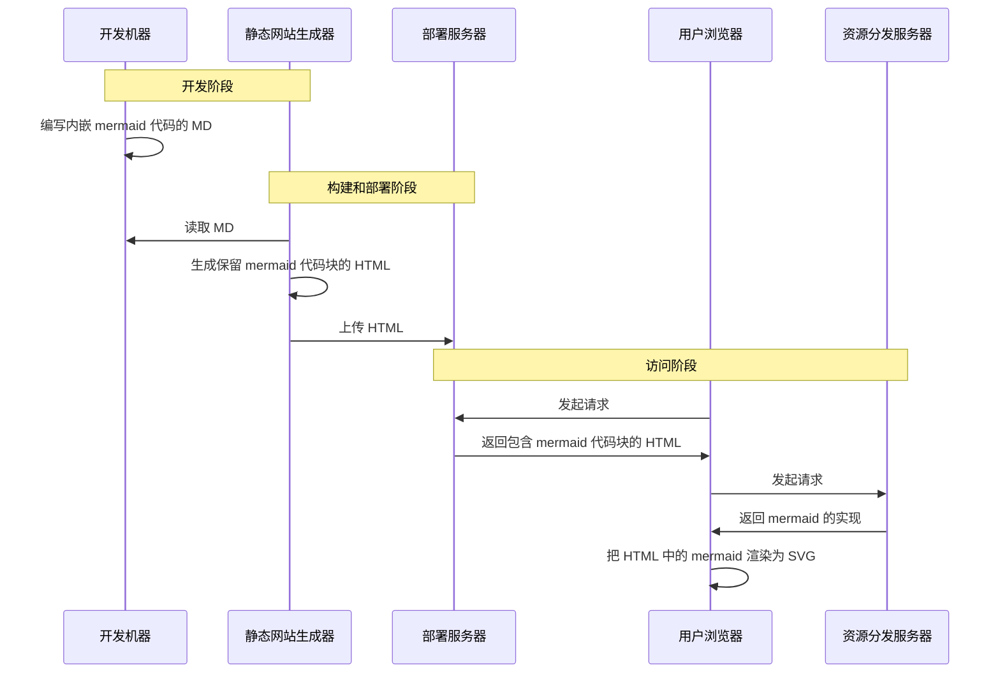

## 简介

Mermaid 是一个用 JavaScript 实现的图表绘制工具，可以通过简单的代码绘制图表。具体的语法可查阅 [官方文档](https://mermaid.js.org/intro/)

## 对比

除了 Mermaid 外，还有很多能够用代码生成图表的工具。但 Mermaid 是其中最流行的方式之一。

Mermaid 流行的主要原因就是可以把代码嵌入 Markdown 文档中。毕竟大多数时候 Markdown 都会转为 HTML，而 Mermaid 恰好有 JavaScript 实现，这使得客户端可以自行完成图片的渲染。Github 的 Markdown 就支持渲染内嵌的 Mermaid 代码，LLM 也常用 Mermaid 来生成和展示图片。

## 原理



如果你掌握了基本的浏览器调试方法，你会发现你并没有接收到上面这张图片，而是接收到了下面的代码，然后在本地完成了渲染

> [!tip] 浏览器调试
> 在本页面右键并点击 **查看页面源代码**，你会看到上面的图表在原始 HTML 中还只是 `pre` 而非 `svg`
>
> 打开 DevTools 的 **源代码** 栏，你应该还能在 `notes/_astro/mermaid.core.***` 中找到 mermaid 的 JavaScript 实现，它把原始 HTML 中 `code` 标签里的代码渲染为 `svg` 图片并进行了替换
>
> 打开 DevTools 的 **元素** 栏，你会发现上面这张图里已经没有 `pre` 标签了，而是被替换为了 `svg` 标签

```txt
sequenceDiagram
    participant DM as 开发机器
    participant SSG as 静态网站生成器
    participant DS as 部署服务器
    participant B as 用户浏览器
    participant RDS as 资源分发服务器

    Note over DM, SSG: 开发阶段
    DM ->> DM: 编写内嵌 mermaid 代码的 MD

    Note over SSG, DS: 构建和部署阶段
    SSG ->> DM: 读取 MD
    SSG ->> SSG: 生成保留 mermaid 代码块的 HTML
    SSG ->> DS: 上传 HTML

    Note over DS, RDS: 访问阶段
    B ->> DS: 发起请求
    DS ->> B: 返回包含 mermaid 代码块的 HTML
    B ->> RDS: 发起请求
    RDS ->> B: 返回 mermaid 的实现
    B ->> B: 把 HTML 中的 mermaid 渲染为 SVG
```

## 安装

Mermaid 提供 [CLI 工具](https://github.com/mermaid-js/mermaid-cli)，可以本地完成图片的导出；也提供了 [VSCode 扩展](https://marketplace.visualstudio.com/items?itemName=MermaidChart.vscode-mermaid-chart)，便于编辑源代码。

### VSCode 扩展

官方 VSCode 扩展为 [Mermaid Chart](https://marketplace.visualstudio.com/items?itemName=MermaidChart.vscode-mermaid-chart)，提供了语言服务、本地预览和导出等功能。

:::tip[社区扩展]

官方扩展集成了很多 AI 功能，并且非常臃肿，口碑不是很好。如果反感可以尝试一下社区的扩展

- [Markdown Preview Mermaid Support](https://marketplace.visualstudio.com/items?itemName=bierner.markdown-mermaid) 已内置于 VSCode，可在 Markdown 中预览 Mermaid 图表
- [Mermaid Markdown Syntax Highlighting](https://marketplace.visualstudio.com/items?itemName=bpruitt-goddard.mermaid-markdown-syntax-highlighting) 为 Mermaid 代码提供语法高亮

:::

### CLI 工具

:::tip[mmdr]

mermaid-cli 有一个用 Rust 重写的 [mmdr](https://github.com/1jehuang/mermaid-rs-renderer)，后者不需要无头浏览器，渲染极快且安装方便。虽然目前还有一点兼容性问题，但非常推荐尝试

```sh
# Windows
scoop install mmdr
```

:::

目前 mermaid-cli 的安装非常麻烦，因为没有打包成单个二进制文件，必须安装 NodeJS 运行时并通过 npm 下载。有能力的或者感兴趣的可以看看 [GitHub Issues](https://github.com/mermaid-js/mermaid-cli/issues/467) 来帮忙解决这个问题

整个安装流程大概是这样的

```sh
# 设置 PUPPETEER_SKIP_DOWNLOAD，跳过无头浏览器的安装
export PUPPETEER_SKIP_DOWNLOAD=1 # Bash
$env:PUPPETEER_SKIP_DOWNLOAD=1 # Pwsh
# 全局安装 mermaid-cli
npm install -g @mermaid-js/mermaid-cli
# 单独安装 chrome-headless，如果已经有的话可以不安装
npx puppeteer browsers install chrome-headless-shell
```

其中最后一步是可选的。如果你的系统中已有 `chromium` 内核的浏览器，可以先试试能否使用，不能用的话再去安装。

最后还要准备一个 `puppeteer.json` 文件，用于指定 `chrome-headless` 可执行文件的路径。通过 `npx puppeteer` 下载的无头浏览器一般在 `~/.cache/puppeteer` 目录里。对于比较新的 Windows 系统，可以先试试自带的 **Edge** 浏览器

```json
// 自定义无头浏览器路径
{
  "executablePath": "path/to/chrome-headless-shell.exe"
}
// Windows 系统建议先试试这个能不能用
{
  "executablePath": "C:\\Program Files (x86)\\Microsoft\\Edge\\Application\\msedge.exe"
}
```

使用 mermaid cli 的时候记得通过 `-p puppeteer.json` 提供这个文件

```sh
mmdc -p puppeteer.json -i example.md -o example.temp.md
```

### Web 集成

:::tip[静态网站生成器]

大多数 _静态网站生成器_ 和 _前端框架_ 都有更方便的 Mermaid 集成方法，你可以阅读对应的文档。

:::

这是我在自己的 [Hugo 博客](https://juemuren.github.io/blog/) 中对 Mermaid 的配置，可以监视主题变化然后重新渲染

```html
<script type="module">
import mermaid from 'https://cdn.jsdelivr.net/npm/mermaid@11/dist/mermaid.esm.min.mjs';

function getTheme() {
  return document.documentElement.dataset.theme === 'dark'
    ? 'dark'
    : 'neutral';
}

function createDiagram(source, index) {
  const container = document.createElement('div');
  container.className = 'mermaid-container';
  source.replaceWith(container);

  return {
    id: `mermaid-diagram-${index + 1}`,
    code: source.textContent.trim(),
    container,
  };
}

async function renderDiagram({ id, code, container }) {
  const { svg, bindFunctions } = await mermaid.render(id, code, container);
  container.innerHTML = svg;
  bindFunctions?.(container);
}

async function renderDiagrams(diagrams) {
  mermaid.initialize({ theme: getTheme(), startOnLoad: false });
  await Promise.all(diagrams.map(renderDiagram));
}

function observeThemeChanges(onThemeChange) {
  const observer = new MutationObserver(() => {
    onThemeChange();
  });

  observer.observe(document.documentElement, {
    attributes: true,
    attributeFilter: ['data-theme'],
  });
}

function init() {
  const diagrams = Array.from(
    document.querySelectorAll('pre.mermaid'),
    createDiagram
  );

  observeThemeChanges(() => renderDiagrams(diagrams));
  renderDiagrams(diagrams);
}

init();
</script>
<style>
.mermaid-container {
  margin: var(--content-gap) auto;
}
.mermaid-container svg {
  display: block;
  margin-inline: auto;
}
</style>
```

除此之外还要在 `layouts/partials/extend_head.html` 中添加如下代码

```html
{{ if .Store.Get "hasMermaid" }} {{ partial "mermaid.html" . }} {{ end }}
```

最后添加 `layouts/_default/_markup/render-codeblock-mermaid.html` 文件

```html
<pre class="mermaid">
  {{ .Inner | htmlEscape | safeHTML }}
</pre>
{{ .Page.Store.Set "hasMermaid" true }}
```

## 使用

后面的使用示例省略了 `-p` 这个参数

```sh
# 单独导出一个图片
mmdc -i input.mmd -o output.png
# 自定义 css 文件
mmdc --input flowchart.mmd --cssFile flowchart.css -o flowchart.svg
# 转换 md 文件，将所有内嵌 mermaid 代码导出为图片并引用
mmdc -i example.template.md -o example.md
```
